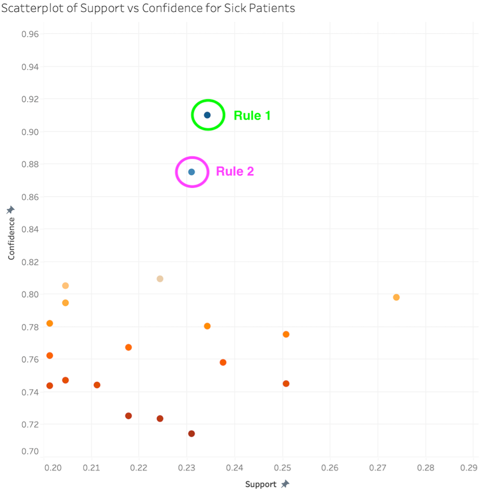
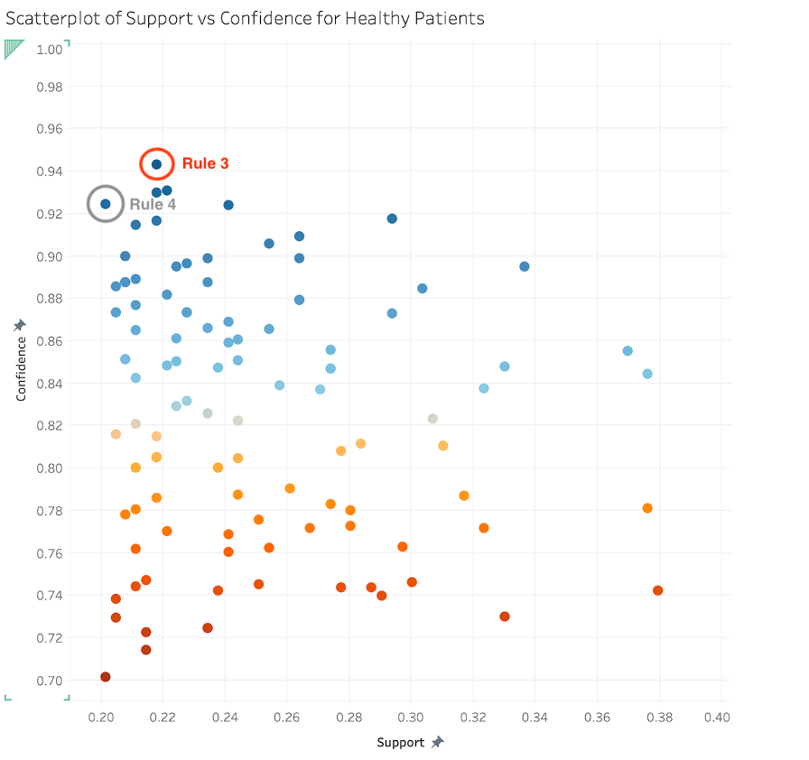

# ❤️ Heart Disease Association Rule Mining

## 📊 Overview
- Apriori-based association rule mining on UCI Cleveland heart disease dataset to uncover relationships between patient attributes and health outcomes using Python and the mlxtend library.

---

## 🎯 Objectives
- Transform patient records into transaction-style data
- Identify frequent itemsets using the Apriori algorithm
- Generate association rules based on confidence
- Focus on association rules with 3 or more items
- Filter rules related to health outcomes (`class=buff` and `class=sick`)
- Visualized association rule metrics (support, confidence, lift) using Tableau

---

## 🔧 Tools Used
- Python
- pandas
- mlxtend (Apriori, association rules)
- Tableau

---

## ⚙️ Process

### 🔹 Data Preparation
- Loaded dataset from `heartdata_recoded.csv`
- Converted each row into transaction format (e.g., `age=old`, `chol=high`)
- Encoded transactions into a binary matrix using `TransactionEncoder`

---

### 🔹 Pattern Mining
- Applied Apriori algorithm with a minimum support threshold of 0.2
- Generated association rules using a confidence threshold of 0.7

---

### 🔹 Rule Filtering
- Calculated total rule length (antecedents + consequents)
- Kept rules with at least 3 items
- Filtered rules for:
  - `class=buff` (healthy)
  - `class=sick` (disease)

---

### 🔹 Output
- `buff_rules.csv` → rules associated with healthy outcomes
- `sick_rules.csv` → rules associated with disease outcomes

---

## 📊 Visualization (Tableau)

- The generated association rules were visualized in Tableau to analyze relationships between variables using support, confidence, and lift metrics.

---

### 🔹 Rules for Sick Class (`class=sick`)

### 🔹 Rules for Healthy Class (`class=buff`)

---

## 🔍 Example Association Rules

- Above are selected high-confidence rules identified by the model:

- **Rule 1:**  
  `{thal=rev, chestpain=asympt} → class=sick`  
  *Confidence:* 0.91 | *Support:* 0.23 | *Lift:* 2.00  

- **Rule 2:**  
  `{exerciseinducedangina=TRUE, chestpain=asympt} → class=sick`  
  *Confidence:* 0.88 | *Support:* 0.23 | *Lift:* 1.92  

- **Rule 3:**  
  `{slope=up, numberofvesselscolored=0, thal=norm} → class=buff`  
  *Confidence:* 0.94 | *Support:* 0.22 | *Lift:* 1.73  

- **Rule 4:**  
  `{gender=fem, exerciseinducedangina=FALSE, thal=norm} → class=buff`  
  *Confidence:* 0.92 | *Support:* 0.20 | *Lift:* 1.70  
---

## 💡 Key Insights

- Combinations of asymptomatic chest pain with either reversible thallium results or exercise-induced angina are frequently associated with patients classified as `class=sick`, indicating strong patterns linked to heart disease.

- In contrast, combinations involving normal thallium results, absence of exercise-induced angina, absence of colored vessels, and an upsloping ST segment are more commonly associated with patients classified as `class=buff`, suggesting these attributes are indicative of healthier outcomes.

---

## 📁 Files
- `association_rules_heart_disease.py` → main analysis script
- `buff_rules.csv` → filtered rules for healthy class
- `sick_rules.csv` → filtered rules for sick class
- `heartdata_recoded.csv`→ input dataset with patient attributes and health outcomes
- `buff_rules_tableau.png` → Tableau visualization (healthy class)
- `sick_rules_tableau.png` → Tableau visualization (sick class)
- `buff_rules.twb` → Tableau visualization (healthy class)
- `sick_rules.twb` → Tableau visualization (sick class)

---

## 🚀 Skills Demonstrated
- Data transformation and preprocessing
- Association rule mining
- Apriori algorithm
- Pattern discovery in structured datasets
